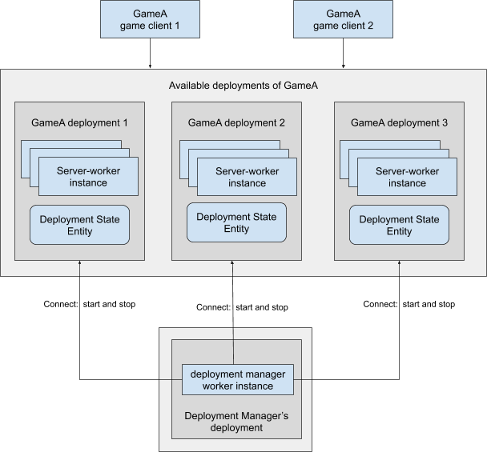

# SpatialOS Deployment Manager

The SpatialOS Deployment Manager is a [SpatialOS](https://docs.improbable.io/reference/latest/index) game management tool. It starts and stops [game deployments](https://docs.improbable.io/reference/latest/shared/glossary#deploying) - instances of your game running in SpatialOS. It’s useful for player-limited and time-limited match-based games such as battle royales where you have multiple game sessions, with a defined number of players.


## Overview
The Deployment Manager is a C# SpatialOS project. You set it up and deploy it separately to setting up and deploying your game project.

Once set up and deployed, the Deployment Manager starts and stops multiple deployments of your game: Every deployment of your game which it can start and stop is a separate game instance with its own SpatialOS [game world](https://docs.improbable.io/reference/latest/shared/glossary#spatialos-world).
<br/>
**Note**: The Deployment Manager does not manage its own deployment; you have to manually start and stop the Deployment Manager as it only starts and stops game deployments.

The Deployment Manager is one [worker](https://docs.improbable.io/reference/latest/shared/glossary#worker) instance.

<br/>
_Conceptual organization of a Deployment Manager and a game’s deployments_

## How to set your game with the Deployment Manager
### Overview

There are two elements to preparing your Deployment Manager:
#### Configure a Deployment Manager project

Inside your Deployment Manager project, there is a `deploymentmanager/config.json` file containing the configuration for your Deployment Manager. Use this to configure the Deployment Manager and your game deployments. 
#### Add a deployment state entity to your game project
Add an entity type to act as a Deployment State Entity to your game.
The Deployment Manager then gets updates on the components in the Deployment State Entity in each of your running game deployments.

**_Example Deployment State Entity_**

* **GDK for Unity**: Deployment State Entity template in the [FPS Starter Project](https://github.com/spatialos/gdk-for-unity-fps-starter-project/blob/master/workers/unity/Assets/Fps/Scripts/Config/FpsEntityTemplates.cs#L19).
* **GDK for Unreal**:  Deployment State Entity template in the [Example Project](https://github.com/spatialos/UnrealGDKExampleProject).
<!--- "TODO: Fix this liatialos/gdk-for-unity-fps-starter-project/blob/develop/workers/unity/Assets/Fps/nk when it’s in the public repo - needs to link to the Deployment State Entity template." --->

#### Example of a Deployment Manager integrated with a game

There is an example implementation of a Deployment Manager in a GDK for Unreal project and a GDK for Unity project:

* **GDK for Unity**: [FPS Starter Project guide on the GDK for Unity documentation website](https://github.com/spatialos/gdk-for-unity-fps-starter-project)

* **GDK for Unreal**: [Example Project on GitHub](https://github.com/spatialos/UnrealGDKExampleProject)
<!--- [//]: # "TODO: Fix this link when it’s in the public repo." --->

### Steps
#### 1. Download and set up a Deployment Manager project

Clone the [Deployment Manager project](https://github.com/spatialos/deployment-manager).

Run a script to download and build the SpatialOS dependencies. To do this, in a command line or terminal window, from the root directory of the cloned Deployment Manager project, enter:

<br/>**Windows**

```
powershell ./build-nuget-packages.ps1
```

<br/> **Mac**
```
./build-nuget-packages.sh
```

You need to generate a service account token. The service account token enables the Deployment Manager to list, start and stop deployments in your SpatialOS project.
(See SpatialOS documentation on [development authentification](https://docs.improbable.io/reference/latest/shared/auth/development-authentication) for more details on tokens.)  </br>

To generate the token, from the root directory of the cloned Deployment Manager project, open a command line or terminal window and enter:

<br/>**Windows**

```
powershell ./generate-service-account-token.ps1 <your SpatialOS project name> <token life time in days>
```

<br/> **Mac**
```
./generate-service-account-token.sh <your SpatialOS project name> <token life time in days>
```
This automatically generates and adds a service account token to your Deployment Manager project. You do not need to make a note of the token or add it to the project manually. 
#### 2. Set up and launch your game

Add an entity template to act as a Deployment State Entity to your game project. 
<br/> (See examples in the projects in the [Overview](#Overview) section above.)  
Add a worker configuration file (`spatialos.DeploymentManager.worker.json`) for the Deployment Manager worker type to your game project. <br/>
(You can copy the worker configuration file examples in the projects [Overview](#Overview) section above.)
Go through the usual workflow to deploy your game locally or to the cloud.
See:
* the GDK for Unreal [local deployment](https://docs.improbable.io/unreal/latest/content/local-deployment-workflow) and [cloud deployment](https://docs.improbable.io/unreal/alpha/content/cloud-deployment-workflow) workflow summaries.
* the GDK for Unity FPS Starter Project guide to [Build your workers](https://docs-staging.improbable.io/unity/latest/projects/fps/get-started/build-workers) and [Upload & launch your game](https://docs-staging.improbable.io/unity/latest/projects/fps/get-started/upload-launch)
* the SpatialOS SDKs documentation on [deploying locally](https://docs-staging.improbable.io/reference/latest/shared/deploy/deploy-local) and [deploying to the cloud](https://docs-staging.improbable.io/reference/latest/shared/deploy/deploy-cloud).    

#### 3. Configure and Launch the Deployment Manager

Update the configuration: navigate to the deployment-manager/DeploymentManager/ directory and, in a text editor, edit the config.json file as shown below:

* `"ClientType": “<edit this>”` is your SpatialOS development platform’s game client type, for example,  `”UnityClient"` or  `"UnrealClient"`.
*  `"NumberOfDeployments": “<edit this>”` is the number of game deployments you want to launch.
* `"AssemblyName": “<edit this>”` is the name of the assembly you uploaded to the cloud in step 2. This enables the Deployment Manager to launch deployments using this assembly.


Launch your Deployment Manager locally on your computer or to the cloud. To do this, follow the steps below. 

##### Launch the Deployment Manager locally on your computer
Open a command line or terminal window and enter:

**_Windows_**<br/>

```
powershell ./publish-windows-workers.ps1 <game launch config path> <game snapshot path>
powershell ./local-launch.ps1
```

**_Mac_**<br/>
```
./publish-macos-workers.sh <game launch config path> <game snapshot path>
./local-launch.sh
```

##### Launch the Deployment Manager in the cloud
Open a command line or terminal window and enter:

**_Windows_**<br/>
```
powershell ./publish-linux-workers.ps1 <game launch config path> <game snapshot path>
powershell ./cloud-launch.ps1 <Deployment Manager assembly name> <Deployment Manager deployment name>
```

**_Mac_**<br/>
```
sh./publish-linux-workers.sh <game launch config path> <game snapshot path>
sh ./cloud-launch.sh <Deployment Manager assembly name> <Deployment Manager deployment name>
```

